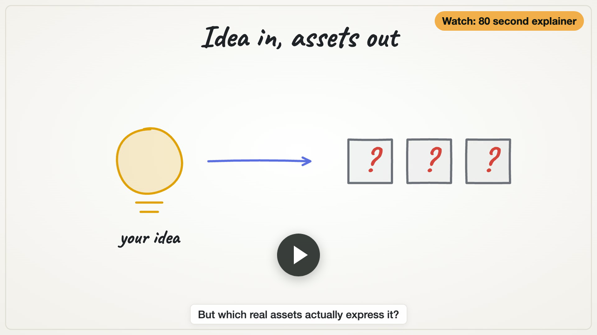
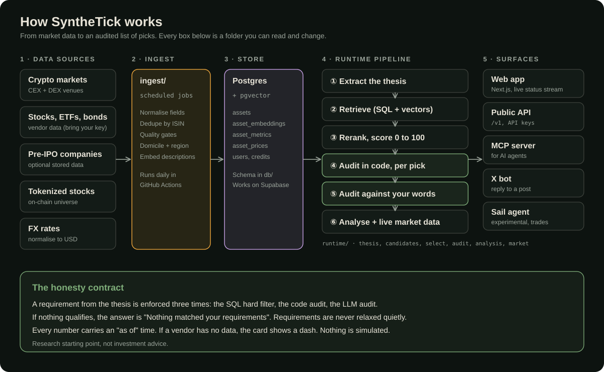
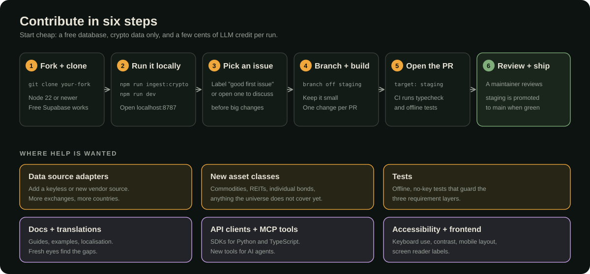

<h1 align="center">SyntheTick</h1>
<p align="center"><b>Turn an investment thesis into audited, evidence-backed picks, without invented numbers.</b><br>
Open source, MIT licensed. Live at <a href="https://synthetick.org">synthetick.org</a>.</p>
<p align="center">
  <a href="LICENSE"></a>
  <a href="https://github.com/Matteoikarieth96/synthetick-oss/actions/workflows/ci.yml"></a>
  <a href="https://github.com/Matteoikarieth96/synthetick-oss/releases"></a>
  <a href="https://github.com/Matteoikarieth96/synthetick-oss/issues?q=is%3Aissue+is%3Aopen+label%3A%22good+first+issue%22"></a>
</p>

<p align="center">
  <a href="docs/assets/synthetick-explainer.mp4"></a><br>
  <sub>Click to watch: about 80 seconds, silent with captions (MP4). Made with AI assistance: script draft and drawings by Claude Code (whiteboard-video skill), reviewed by the maintainer.</sub>
</p>

You paste a thesis, an article, a tweet or a PDF. SyntheTick pulls out the idea and the rules you set
("only crypto", "European ETFs only", "no defense"), searches a universe of stocks, ETFs, bond funds, crypto and selected
pre-IPO companies, ranks up to ten assets with a 0 to 100 alignment score and a reason, audits every pick twice, and attaches
real market data. It is a **research starting point, not investment advice**.

## The honesty contract

- A requirement from your thesis is enforced **three times**: a SQL hard filter, a deterministic code audit, and an LLM audit against your own words.
- If nothing qualifies, the answer is "Nothing matched your requirements". Requirements are never relaxed quietly.
- Every number carries an "as of" time. If a vendor has no data, the card shows a dash. Nothing is simulated.

## How it works

<p align="center"></p>

| Folder | What lives there |
|---|---|
| `ingest/` | Scheduled data jobs: normalise, dedupe by ISIN, quality gates, embeddings |
| `runtime/` | The pipeline: thesis extraction, retrieval, rerank, two audits, analysis, market data. Prompts live here as plain strings |
| `server/` | HTTP server: web API with live status stream, public `/v1` API, MCP server, rate limits |
| `app/`, `public/` | The web app (Next.js shell plus the interaction layer) |
| `bot/` | The X bot |
| `db/` | Postgres schema, RLS, functions. See [db/README.md](db/README.md) |
| `sail-agent/` | Experimental autonomous agent that trades tokenized stocks. **Can move real funds.** Separate from the app, read its README first |
| `docs/` | [Documentation](docs/DOCUMENTATION.md), [API and MCP](docs/API.md), [quickstart](docs/QUICKSTART.md), test reports |

The single source of truth for behaviour is [SPEC.md](SPEC.md). When code and spec disagree, the spec wins; if you change a decision, change the spec first.

## Run it

The cheapest honest setup is crypto only: a free Supabase project, a Voyage key, an OpenRouter key and a few cents of LLM credit per run.
Follow the [quickstart](docs/QUICKSTART.md).

```bash
npm install
npm run typecheck && npm run test:offline   # no keys, no database, no .env needed
cp .env.example .env     # then fill in the REQUIRED values to run the app
```

## Use it from code

A public HTTP API and an MCP server for AI agents (same API keys, 1 credit per screen). See [docs/API.md](docs/API.md).

## Contribute

<p align="center"></p>

Read [CONTRIBUTING.md](CONTRIBUTING.md). Pull requests target `staging`. Look for the `good first issue` label.
Security problems go through the private report on the Security tab, see [SECURITY.md](SECURITY.md). Running it for other people? Read [docs/PRIVACY.md](docs/PRIVACY.md).
Be kind: [CODE_OF_CONDUCT.md](CODE_OF_CONDUCT.md).

## Data, licenses and trademarks

- **No vendor data payloads are in this repository.** The only data file is a public on-chain registry (`runtime/universe/robinhood-chain.json`: token contracts from Robinhood's public stock-token API, decimals and holder counts read from the chain explorer). Bring your own keys and read each vendor's terms before you display or redistribute their data. Equity and ETF data vendors usually require a separate display license for public apps, so the app hides that data unless you say you hold one (see `.env.example`).
- **Attribution is required for some free sources.** If you show CoinGecko API data, show "Data provided by CoinGecko" with a link to https://www.coingecko.com/en/api next to it; for GeckoTerminal data, "On-chain data provided by GeckoTerminal" with a link to https://www.geckoterminal.com. The app does this out of the box.
- The code is [MIT](LICENSE), except the brand assets in `brand/`. Third-party files keep their own notices: see [NOTICE.md](NOTICE.md) and [THIRD_PARTY.md](THIRD_PARTY.md).
- The SyntheTick name, logo and Dino mascot are not licensed for use as your own brand, see [TRADEMARKS.md](TRADEMARKS.md). Other company names are used only to say which service a piece of code talks to; no affiliation or endorsement is implied.
- Nothing here is investment, legal or tax advice. Tokenized securities and crypto assets can be restricted where you live, and `sail-agent/` can move real funds.
